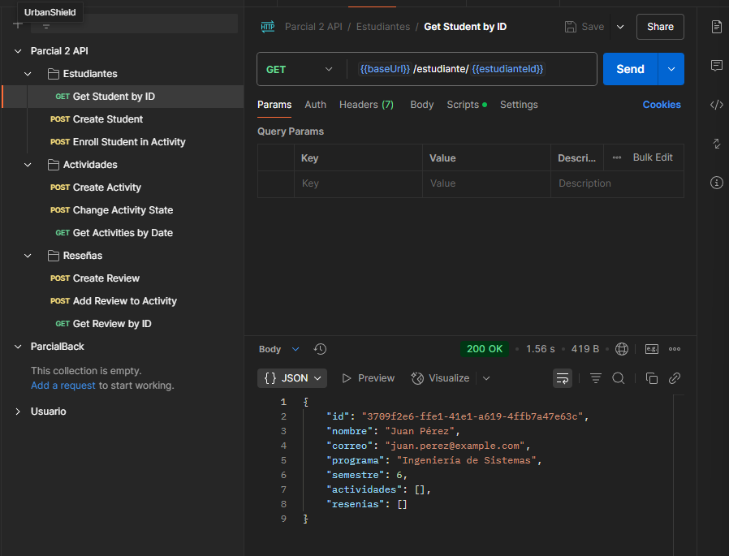
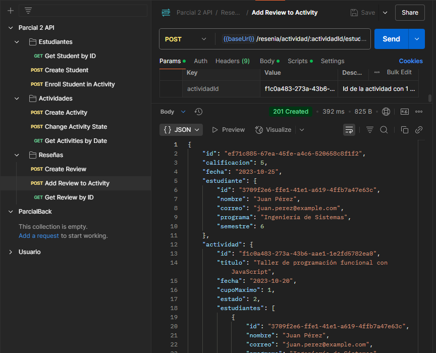

# Documentación de la API

---

## Estudiantes

### Obtener Estudiante por ID
- **Método:** `GET`
- **Ruta:** `/estudiante/:estudianteId`
- **Descripción:** Recupera los datos de un estudiante por su ID, incluyendo sus actividades y reseñas asociadas.

- **Parámetros de Ruta:**
  - `estudianteId`: UUID del estudiante a consultar

- **Respuesta Exitosa:** Objeto **estudiante** con sus relaciones

- **Posibles Errores:**
  - `404 Not Found`: El estudiante con el ID proporcionado no existe

---

### Crear Estudiante
- **Método:** `POST`
- **Ruta:** `/estudiante`
- **Descripción:** Crea un nuevo estudiante en el sistema.
- **Cuerpo de la Solicitud:**
  ```json
  {
    "nombre": "Juan Pérez",
    "correo": "juan.perez@ejemplo.com",
    "programa": "Ingeniería de Sistemas",
    "semestre": 6
  }


* **Validaciones:**

  * El correo debe tener un formato válido
  * El semestre debe estar entre **1** y **10**

* **Respuesta Exitosa:** Objeto **estudiante** creado

---

### Inscribir Estudiante en Actividad

* **Método:** `POST`

* **Ruta:** `/estudiante/:estudianteId/actividad/:actividadId`

* **Descripción:** Inscribe a un estudiante existente en una actividad.

* **Parámetros de Ruta:**

  * `estudianteId`: UUID del estudiante
  * `actividadId`: UUID de la actividad

* **Respuesta Exitosa:** Objeto **estudiante** actualizado con la nueva actividad

* **Posibles Errores:**

  * `404 Not Found`: El estudiante o la actividad no existen

---

## Actividades

### Crear Actividad

* **Método:** `POST`

* **Ruta:** `/actividad`

* **Descripción:** Crea una nueva actividad en el sistema.

* **Cuerpo de la Solicitud:**

  ```json
  {
    "titulo": "Taller de programación funcional con JavaScript",
    "fecha": "2023-10-20",
    "cupoMaximo": 20,
    "estado": 0
  }
  ```

* **Validaciones:**

  * El título debe tener al menos **15** caracteres
  * El estado siempre se establece en **0** (abierta) inicialmente

* **Respuesta Exitosa:** Objeto **actividad** creada

---

### Cambiar Estado de Actividad

* **Método:** `POST`

* **Ruta:** `/actividad/:actividadId/estado/:estado`

* **Descripción:** Cambia el estado de una actividad existente.

* **Parámetros de Ruta:**

  * `actividadId`: UUID de la actividad
  * `estado`: Nuevo estado (`0` = abierta, `1` = cerrada, `2` = finalizada)

* **Validaciones:**

  * Para estado **1** (cerrada): se requiere al menos **80 %** de ocupación
  * Para estado **2** (finalizada): se requiere **100 %** de ocupación (cupo lleno)

* **Respuesta Exitosa:** Objeto **actividad** actualizada

* **Posibles Errores:**

  * `404 Not Found`: La actividad no existe
  * `412 Precondition Failed`: No se cumple el porcentaje de ocupación requerido

---

### Obtener Actividades por Fecha

* **Método:** `GET`

* **Ruta:** `/actividad/fecha/:fecha`

* **Descripción:** Obtiene todas las actividades programadas para una fecha específica.

* **Parámetros de Ruta:**

  * `fecha`: Fecha en formato `YYYY-MM-DD`

* **Respuesta Exitosa:** Array de objetos **actividad** con sus relaciones

---

## Reseñas

### Crear Reseña

* **Método:** `POST`

* **Ruta:** `/resenia`

* **Descripción:** Crea una nueva reseña sin asociarla a ningún estudiante o actividad.

* **Cuerpo de la Solicitud:**

  ```json
  {
    "comentario": "Excelente actividad, aprendí mucho",
    "calificacion": 4
  }
  ```

* **Respuesta Exitosa:** Objeto **reseña** creada

---

### Agregar Reseña a Actividad

* **Método:** `POST`

* **Ruta:** `/resenia/actividad/:actividadId/estudiante/:estudianteId`

* **Descripción:** Agrega una reseña a una actividad por parte de un estudiante.

* **Parámetros de Ruta:**

  * `actividadId`: UUID de la actividad
  * `estudianteId`: UUID del estudiante

* **Cuerpo de la Solicitud:**

  ```json
  {
    "comentario": "¡Muy buen taller!",
    "calificacion": 5
  }
  ```

* **Validaciones:**

  * La actividad debe existir
  * La actividad debe estar **finalizada** (`estado = 2`)
  * El estudiante debe existir
  * El estudiante debe estar inscrito en la actividad

* **Respuesta Exitosa:** Objeto **reseña** creada con relaciones

* **Posibles Errores:**

  * `404 Not Found`: La actividad o el estudiante no existen
  * `412 Precondition Failed`: La actividad no está finalizada o el estudiante no está inscrito

---

### Obtener Reseña por ID

* **Método:** `GET`

* **Ruta:** `/resenia/:reseniaId`

* **Descripción:** Recupera una reseña por su ID, incluyendo la actividad y el estudiante relacionados.

* **Parámetros de Ruta:**

  * `reseniaId`: UUID de la reseña

* **Respuesta Exitosa:** Objeto **reseña** con sus relaciones

* **Posibles Errores:**

  * `404 Not Found`: La reseña con el ID proporcionado no existe

## Pruebas Realizadas en Postman

Se realizaron pruebas a todas las peticiones en postman, esto para verificar su funcionamiento y la importancia de estas para la aplicación. Para estas pruebas, las variables utilizadas fueron los IDs autogenerados por la base de datos de Postgres. Si se quieren replicar las pruebas, se deberán modificar manualmente cada ID en los parámetros de la petición para obtener los resultados deseados.

**Get Estudiante por ID**


**Crear Estudiante**


**Añadir Estudiante a Actividad**


**Crear Actividad**


**Cambiar Estado de Actividad**


**Get Actividades por Fecha**


**Crear Reseña**


**Añadir Reseña a Actividad**


**Get Reseña por ID**
